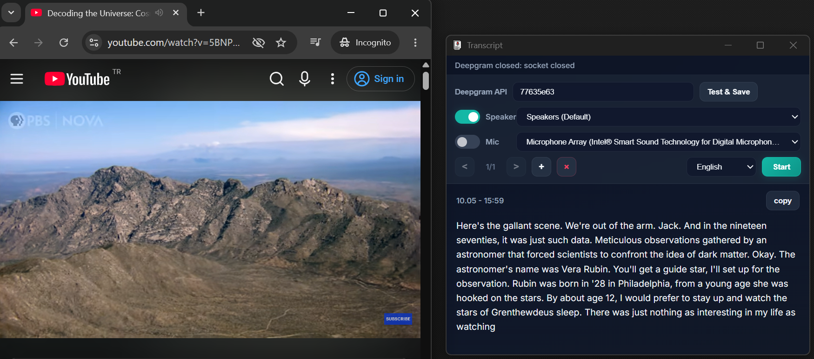
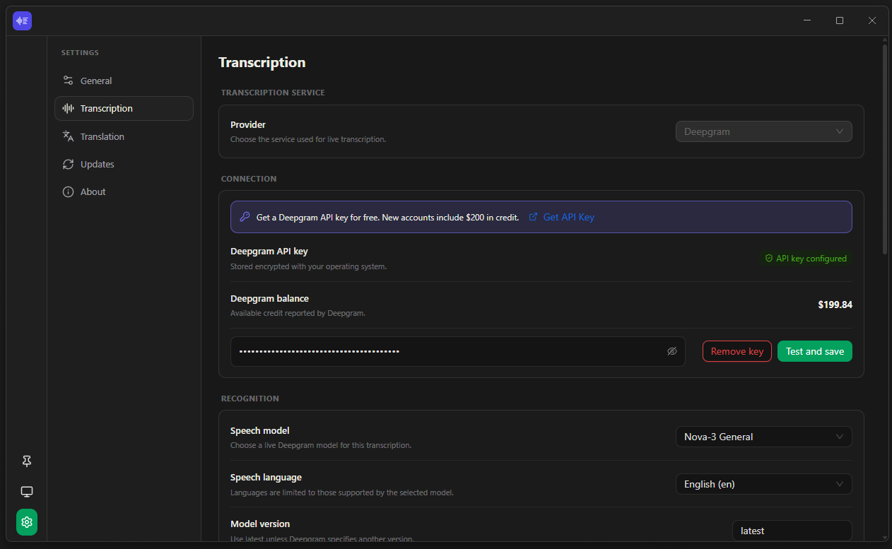

# Transcript

Transcript is an Electron desktop application that captures microphone and speaker audio independently and provides both real-time transcription and translation using Google and Bing.

Chrome Transcript Extension -> https://github.com/bariskisir/ChromeTranscript

Chrome Live Translator Extension -> https://github.com/bariskisir/ChromeLiveTranslator




---

## Install

1. Download the latest release for your platform from [Releases](https://github.com/bariskisir/transcript/releases/latest).
2. Install or extract the package.
3. Run **Transcript**.

## Development

```bash
git clone https://github.com/bariskisir/transcript.git
cd transcript
npm run dev
```

## License

MIT
