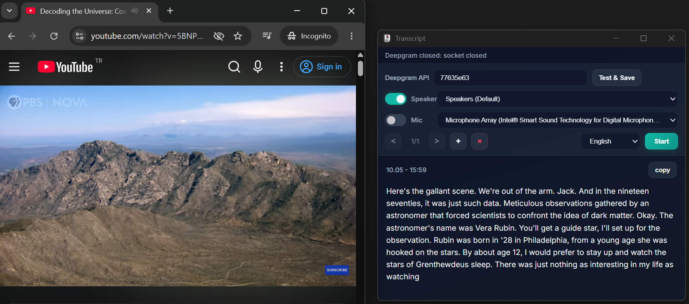
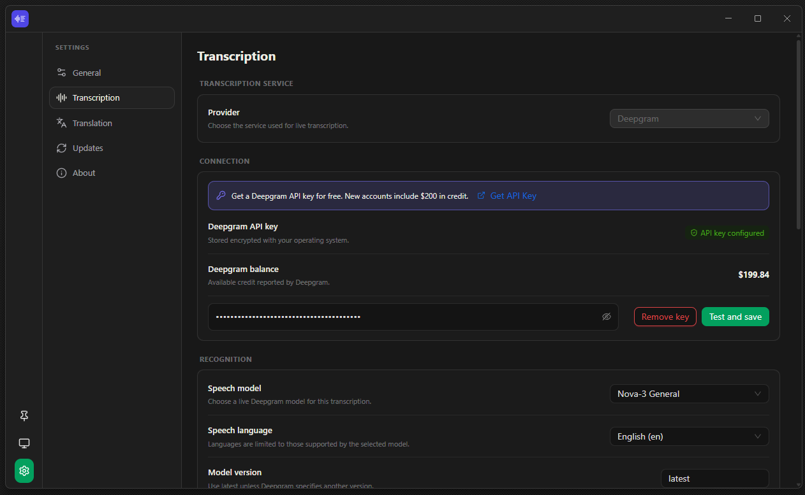

<p align="center">
  
</p>

<h1 align="center">Transcript</h1>

<p align="center">
  Real-time transcription and translation of microphone and speaker audio.
</p>

<p align="center">
  <a href="https://github.com/bariskisir/Transcript/actions/workflows/release.yml"></a>
  <a href="https://github.com/bariskisir/Transcript/releases/latest"></a>
  <a href="https://github.com/bariskisir/Transcript/releases"></a>
  <a href="LICENSE"></a>
</p>

<p align="center">
  
  
</p>

---

## Install

1. Download the latest release for your platform from [Releases](https://github.com/bariskisir/transcript/releases/latest).
2. Install or extract the package.
3. Run **Transcript**.

## Development

```bash
git clone https://github.com/bariskisir/transcript.git
cd transcript
npm run dev
```

Chrome Transcript Extension -> https://github.com/bariskisir/ChromeTranscript

Chrome Live Translator Extension -> https://github.com/bariskisir/ChromeLiveTranslator

## License

MIT
